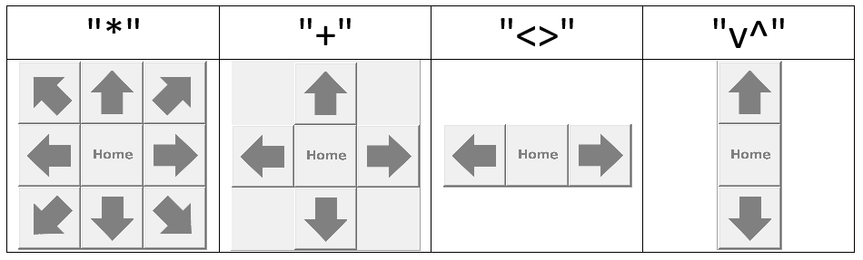
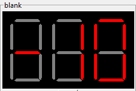
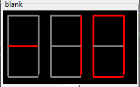
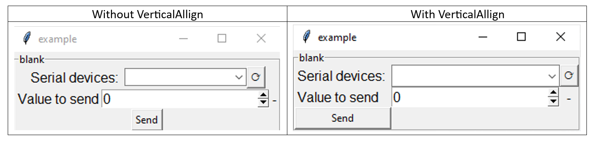

LabControl
##########

Getting started
***************

PToolkit LabControl provides an environment for creating gui applications for lab setups. 
It does this by introducing a standard framework and a set of widgets. To get started create a project using the follow command where <projectname> is the name of your application

::
    
    PToolkit newproject <projectname>

This creates the following file structure:
::

    project
    ├── interfaces
    │   └── blankinterface.py
    ├── log
    ├── scripts        
    ├── profiles        
    ├── .state
    └── Main.py      

The Interfaces folder contains all the application's interfaces. An interface is a piece of code containing one or more widgets that can be duplicated or easily shared with others.
The log folder contains the application logs, the scripts folder contains Python scripts that can be called using a script loader, the profiles folder is currently unused.
The .state file stores parameter values, these values are reloaded when the application is restarted. The Main.py file is the main application file where all interfaces are added to the application.

The main application file looks like:

::

    # Configure some important things
    import sys, os, logging
    BASEDIR = os.path.dirname(os.path.abspath(__file__))

    from PToolkit.LabControl import MainPToolkitApp, PTOOLKITLOGGER

    # Configuring the logger
    PTOOLKITLOGGER.setLevel(logging.INFO)

    # Loading the interfaces folder
    sys.path.append(BASEDIR + "\\interfaces")

    # Your application
    # ------------------------------------------------------------------------------------------------
    from blankinterface import blankinterface
            
    root = MainPToolkitApp()

    blankinterface(root, "BlankInterface").pack()

    if __name__ == "__main__":
        root.mainloop()

The MainPToolkitApp functions as TK from tkinter with the only difference being some background stuff such as handeling the .state file. 
Every interface that is created behaves as a tkinter labelframe, and must be placed under the definition of root, both pack and grid are supported for interfaces.  
The PTOOLKITLOGGER is automaticly imported and configured, only when debugging change the level to DEBUG (this will slow down the application). The blankinterface.py looks like:

:: 

    from PToolkit.LabControl import Interface
    import tkinter as tk
    from tkinter import ttk
    import sys

    sys.path.append("dependencies/")

    class blankinterface(Interface):

        def __init__(self, root, name):
            Interface.__init__(self, root, name)

            self.label = tk.Label(self.frame, text="Welcome to PToolkit")

        def __GUI__(self):
            self.label.pack()
        

Every interface created must inherit from interface, make sure this is the first inheritance. By convention all widgets are created in the __init__ method, 
and all the placement of the widgets is done in the __GUI__ method. This method is automaticly called when it is added to the MainPToolkitApp. 
Creating a new interface can be done by hand or by terminal using the following command:

::

    PToolkit newinterface <interfacename>

Example
*******
In this example we will create a very simple Arduino interface. We create our project using the following command:
::
    
    PToolkit newproject myfirstapp

And create a new interface using (make sure to be in the interface dir):
::

    PToolkit newinterface Arduino

In our Arduino.py file we will first add a VerticalAllign object to allign our widgets and a terminal::

    class Arduino(Interface):

        def __init__(self, root, name):
            Interface.__init__(self, root, name)

            self.valign = VerticalAllign(self)
            self.terminal = Terminal(self)
            self.terminal.grid(row=0, column=1)

        def __GUI__(self):
            self.valign.grid(row=0, column=0, sticky="N")

Next we will import serial and add a serial object and portselector (make sure to put self.valign as the root parameter)::

    self.serial = serial.Serial(baudrate=9600)
        
    self.portselector = SerialPortSelector(self.valign, self.serial, terminal=self.terminal)

We write two quick methods to talk to our Arduino::

    def ReadArduino(self):
        try:
            return self.serial.readline().decode("utf-8").rstrip()
        except:
            pass
    
    def SendVar(self):
        msg = (str(self.var) + "\n").encode("utf-8")
        self.serial.write(msg)

Next we will add a parameterfield and button to our application (make sure it is the PToolkit button, otherwise it won't work with VerticalAllign)::

    self.var = ParameterField(self.valign, "Value to send")

    self.button = Button(self.valign, text="Send")    

The last thing to do is a bit more complicated. We will add a producer and consumer thread, these will handle the data stream for us.
These threads will communicate with eachother via a queue (import queue) we create one with size 10.::

    self.prod = ProducerThread(
            name="ArduinoRead",
            generationfunction=self.ReadArduino, 
            queue=self.arduino_queue,
            interval=0.1,
            terminal=self.terminal
        ) 

        self.cons = ConsumerThread(
            name="TerminalPrinter",
            consumerfunction=self.terminal.terminal_msg,
            queue=self.arduino_queue,
            interval=0.1,
            terminal=self.terminal
            )

        self.prod.start()
        self.cons.start()

The producer thread will execute the self.Arduino method every 0.1 seconds and put the data into the queue. The consumer thread takes one piece of data out of the queue every 0.1 seconds. 
All of this happens on the background, therefore the impact on our application is minimal. Both threads are started using the start method. Note that for a very simple Arduino program these
threads are not required, one can simple run readline after write and as long as the Arduino respons in a reasonable time. Combining all these things together. Our Main.py file looks like::

    # Configure some important things
    import sys, os, logging
    BASEDIR = os.path.dirname(os.path.abspath(__file__))

    from PToolkit.LabControl import MainPToolkitApp, PTOOLKITLOGGER

    # Configuring the logger
    PTOOLKITLOGGER.setLevel(logging.INFO)

    # Loading the interfaces folder
    sys.path.append(BASEDIR + "\\interfaces")

    # Your application
    # ------------------------------------------------------------------------------------------------
    from Arduino import Arduino
            
    root = MainPToolkitApp()

    Arduino(root, "Arduino").pack()

    if __name__ == "__main__":
        root.mainloop()

And our Arduino.py file looks like::

    sys.path.append("dependencies/")

    from PToolkit.LabControl import *
    import tkinter as tk
    import serial, queue

    class Arduino(Interface):

        def __init__(self, root, name):
            Interface.__init__(self, root, name)

            self.valign = VerticalAllign(self)

            self.terminal = Terminal(self)
            
            self.serial = serial.Serial(baudrate=9600)
            
            self.portselector = SerialPortSelector(self.valign, self.serial, terminal=self.terminal)

            self.var = ParameterField(self.valign, "Value to send")

            self.button = Button(self.valign, text="Send", command=self.SendVar)       

            self.arduino_queue = queue.Queue(10)

            self.prod = ProducerThread(
                name="ArduinoRead",
                generationfunction=self.ReadArduino, 
                queue=self.arduino_queue,
                interval=0.1,
                terminal=self.terminal
            ) 

            self.cons = ConsumerThread(
                name="TerminalPrinter",
                consumerfunction=self.terminal.terminal_msg,
                queue=self.arduino_queue,
                interval=0.1,
                terminal=self.terminal
                )

            self.prod.start()
            self.cons.start()

        def __GUI__(self):
            self.valign.grid(row=0, column=0, sticky="N")
            self.terminal.grid(row=0, column=1)
        
        def ReadArduino(self):
            try:
                return self.serial.readline().decode("utf-8").rstrip()
            except:
                pass
        
        def SendVar(self):
            msg = (str(self.var) + "\n").encode("utf-8")
            self.serial.write(msg)

The following code on the Arduino

.. code-block:: cpp

    void setup() {
        Serial.begin(9600);
    }

    void loop() {
        while (Serial.available() == 0) {}     
        String mystr = Serial.readString();  
        mystr.trim();
        Serial.print("Arduino reads: ");
        Serial.println(mystr);
    }

When running this application pressing the send button will send the data from the parameterfield to the Arduino and the Arduino will respond with
"Arduino reads" + the parameterfield value.

Core classes
************

.. py:class:: MainPToolkitApp

    The main application of for the LabControl part of PToolkit

    .. note::
        MainPToolkitApp functions the same as tk.TK, only difference is that it handles interafaces in the background.

    .. method:: __init__(appname)

        :param str appname:
            The name of the application.

    .. method:: mainloop()

        Method to start the mainloop

    .. method:: set_exit_func(func)

        Method that allows the user to execute a function before the application closses.

        :param func func:
            Function to be executed

.. py:class:: Interface

    The interface class providing a common backend to PToolkit widgets.

    .. method:: __init__(master, name)

        :param master: PToolkit main application

        :pram str name: 
            The name of the interface. Must be unique in each application

.. py:class:: Parameter

    Some of the PToolkit widgets inherit from the Parameter subclass. This means that these widgets acts like a number when performing arithmetic's. 
    For example the display class

    .. code-block:: python

        self.display = Display(root, "Test")
        self.display.pack()

        new_value = self.display + 1 
        new_value = self.display * 100
        new_value = self.display / 100

    Some of the parameters (currently only the parameterfield) will save them self when the application is closed, and reload them selfs when restatring. 
    Thus setting a parameterfield to 102.1, closing the application and restarting will mean that the 102.1 is still there. These values are stored in the .state file of the application.

Widgets
*******

Controls
---------

.. py:class:: Button

    A button class currently only used for a compatibility issues with VerticalAllign.

    .. method:: __init__(root, text="", command=None)

        :param root: Parent window

        :param str text: Text on the button

        :param function command: function to execute when pressed.

.. py:class:: KeyBoard

    Class that creates a widget having a variable amount of buttons that can be mapped. 
    Great for controlling movement based robots. 
    
    .. method:: __init__(root, grid, textgrid=None, commandgrid=None, imagegrid=None)

        :param root: Parent window

        :param list grid: 
           List with 0 or 1 to indicate where a button must be placed

        :param list textgrid: 
            A list with text for each index

        :param list commandgrid: 
            A list with functions for each index

        :param list imagegrid: 
            A list with image paths for each index

Example ::

    from PToolkit.LabControl import KeyBoard
    import numpy as np

    class blankinterface(Interface):

        def __init__(self, root, name):
            Interface.__init__(self, root, name)

            # TTi 1604 buttons
            self.keyboard = KeyBoard(self, np.ones((3, 4)),
                                    [
                                        ["mV", "V", "\u2126", "\u2191"],
                                        ["mA", "A", "Hz", "\u2193"],
                                        ["DC", "AC", "SHIFT", "Auto"]
                                    ],
                                    commandgrid= [
                                        [self.myfunc1, self.myfunc2, self.myfunc1, self.myfunc2],
                                        [self.myfunc1, self.myfunc2, self.myfunc1, self.myfunc2],
                                        [self.myfunc1, self.myfunc2, self.myfunc1, self.myfunc2],
                                        [self.myfunc1, self.myfunc2, self.myfunc1, self.myfunc2]  
                                    ]
                                    )
            
        def __GUI__(self):
            self.keyboard.pack()
            
        def myfunc1(self):
            print("1")

        def myfunc2(self):
            print("2")

.. py:class:: ArrowKeyPad

    Class that creates a widget having a variable amount of buttons that can be mapped. 
    Great for controlling movement based setups, such as: microscopes, robots or 3D printers.

    .. method:: __init__(root, commandgrid, size=(4, 4), includehome=False, design="*")

        :param root: Parent window

        :param list commandgrid: 
            A 3x3 list with a function or None in each of its entrys. Each of the entrys corrosponds with the button at that position.
        

        :param tuple size: 
            Tuple of the size of the buttons.
        

        :param bool includehome: 
            If a home button must be included.

        :param str design: 
            The design used for the widget, options: 
            :const:`*`, :const:`+`, :const:`<>` :const:`v^`
    

Example::

    class blankinterface(Interface):

        def __init__(self, root, name):
            Interface.__init__(self, root, name)

        
            self.mykeypad = ArrowKeyPad(self, 
                        includehome=False,
                        design="+",
                        commandgrid= [
                            [None, self.myfunc, None],
                            [self.myfunc, None, self.myfunc],
                            [None, self.myfunc, None]
                        ])
            
        def __GUI__(self):
            self.mykeypad.pack()
            
        def myfunc(self):
            print("test")

.. py:class:: StatusLED

    Method that adds a status led, that can be toggled to show a status. Green for a True state and red for a Fase state.

    .. method:: __init__(root, text)

        :param root: Parent window

        :param str text:
            The text that must be inserted into the label
        
    .. method:: toggle_state()

        Method that will invert the state it is currently in.

    .. method:: set_state(state)

        :param bool state:
            if True the LED will change to a green, if False it changes to red. 
    
    .. method:: get_state()

        :return: The current state of the LED
        :rtype: bool

Example::

    from PToolkit.LabControl import StatusLED

    class blankinterface(Interface):

        def __init__(self, root, name):
            Interface.__init__(self, root, name)

            self.led = StatusLED(self, "Status")

            # self.frame must be used instead of self for default tkinter objects. 
            self.button = tk.Button(self.frame, text="toggle", command=self.led.toggle_state)
            
        def __GUI__(self):
            self.led.pack()
            self.button.pack()

Hardware interfacing
--------------------

SerialPortSelector is a widget that makes it easy to connect to a serial devices while the main application is running. This can for exampl be used to select a specific Arduino during operation.

.. py:class:: SerialPortSelector

    Class that creates a widget that can be used to scan and select serial devices. 

    .. method:: __init__(root, serial, text="Serial devices: ", terminal=None)
        
        :param root: Parent window

        :param serial.Serial serial: Serial object from the pyserial library

        :param str text: Text that is displayed on the label.

        :param PToolkit.Terminal terminal: PToolkit terminal object
        
    .. method:: set_port(port)

        Method to set the current port on the serial object.

        :param str port: The serial port to connect to.

    .. method:: get_serial_devices()

        Method scans for available serial ports

        

SerialPortSelector adds the following command to the terminal:

* reloadserial: Scans the available serial devices again

Example::

    from PToolkit.LabControl import SerialPortSelector
    import serial

    class blankinterface(Interface):

        def __init__(self, root, name):
            Interface.__init__(self, root, name)

            self.serial = serial.Serial()
            self.portselect = SerialPortSelector(self, self.serial)
            
        def __GUI__(self):
            self.portselect.pack()

Terminal
--------

.. py:class:: Terminal

    Class that creates a terminal widget, that can be used to communicate with the user during operation. It can also be used to execute commands. 

    .. method:: __init__(root, text=None, allowcommands=True)

        :param root: Parent window

        :param str text: 
            Text to be displayed on the labelframe

        :param bool allowcommands:
            If typing commands in the terminal should be allowed
    
    .. method:: terminal_msg(msg, error=False)

        A method that prints a message or error in the terminal.

        :param str msg: 
            The message the user wants to print in ther terminal.

        :param bool error:
            If the msg must be printed as an error message. If True the message will be printed in red.
    
    .. method:: list_commands()

        A method that prints the available commands in the terminal and adds there doc string as a description.

    .. method:: run_command(command)

        Method that runs a command in the terminal. 

        :param str command:
            The command that the user wants to run in the terminal. 

    .. method:: add_command(name, function)

        Method that adds a command to the terminal.

        :param str name:
            The command that the user wants add to the terminal.

        :param function function:
            The function that must be executed when the command is called. 
    
    .. method:: add_progressbar(name, max)

        Method that adds a progressbar to the terminal. 

        :param str name:
            The name of the progressbar that is used to access it. 
        
        :param int max:
            Maximum of iterations. 
        
    .. method:: delete_progressbar(name)

        Method that deletes a progressbar.

        :param str name:
            The name of the to be deleted progressbar

    .. method:: update_progressbar(name, amount)

        Method to update a progressbar by a variable amount.

        :param str name:
            The progressbar that must be updated.

        :param int amount: 
            The amount of iterations that must be added to the progressbar. 

    .. attribute:: commands:

        A dictionary were the keys are commands and the value is the function to be executed. 

Terminal comes with the base commands:

* help: Lists all available commands in the terminal
* history: Shows the command history.
* clearhistory: Clears the command history.
* clearterminal: Clears the terminal text.
* clearall: Clears both the command history and terminal

Example standard use of a terminal::

    from PToolkit.LabControl import Terminal

    class blankinterface(Interface):

        def __init__(self, root, name):
            Interface.__init__(self, root, name)

        
            self.terminal = Terminal(self)

            self.terminal.terminal_msg("My first msg")
            self.terminal.terminal_msg("This is a error", True)

            self.terminal.add_command("myfunc", self.myfunc)
            
        def __GUI__(self):
            self.terminal.pack()
            
        def myfunc(self):
            self.terminal.terminal_msg("Hello from myfunc")

When running the code above and typing "myfunc" in the terminal will run the myfunc method.

Example progressbar::

    from PToolkit.LabControl import Terminal

    class blankinterface(Interface):

        def __init__(self, root, name):
            Interface.__init__(self, root, name)
        
            self.terminal = Terminal(self)

            self.terminal.add_progressbar("myprogress", 5)

            self.terminal.add_command("add", self.myfunc)
            
        def __GUI__(self):
            self.terminal.pack()
            
        def myfunc(self):
            self.terminal.update_progressbar("myprogress", 1)

When running the code above and typing "myfunc" in the terminal will update the progressbar.

Data displays and manipulation
------------------------------

.. py:class:: Plot

    Class that creates a plot widget for live data plotting. 

    .. method:: __init__(root, interval=10, maxpoints=50, ylim=(0, 10), diplayfps=False)
        
        :param root: Parent window

        :param int interval: 
            Interval in update function.

        :param int maxpoints:
            Maximum amount of points to dispaly at any time.

        :param tuple ylim:
            The limits of the y-axis

        :param bool displayfps:
            Show the fps of the plot inside the plot.
        
    .. method:: set_xlabel(label)

        Method to set the xlabel of the plot.

        :param str label: The x label to set. 

    .. method:: set_ylabel(label)

        Method to set the y label of the plot.

        :param str label: The y label to set. 

    .. method:: update_plot(x, y):

        Method to set the x and y values of the plot

        :param list x: 
            List of x values

        :param list y: 
            List of y values
    
    .. method:: appendy(value)
        
        Method to append a vlaue to the y array. Automaticly increments x. 

        :param float value:
            Value that must be appended to the y-axis. 

    .. method:: get_serial_devices()

        Method scans for available serial ports

Example::

    from PToolkit.LabControl import Plot
    import random

    class blankinterface(Interface):

        def __init__(self, root, name):
            Interface.__init__(self, root, name)
        
            self.plot = Plot(root)

            self.plot.set_xlabel("x")
            self.plot.set_ylabel("y")

            # self.frame must be used instead of self for default tkinter objects.
            self.button = tk.Button(self.frame, text="Add", command=self.myfunc)
            
        def __GUI__(self):
            self.plot.pack()
            self.button.pack()
            
        def myfunc(self):
            self.plot.appendy(random.randint(1, 9))

.. py:class:: SevenSegmentDisplay

    Class that creates a seven segment display. Supports floats and ints.

    .. method:: __init__(root, digits, negative_numbers=True, style="hexagon")
        
        :param root: Parent window

        :param int digits: 
            The amount of digits to display

        :param bool negative_numbers:
            If negative numbers are allowed to be displayed. If true adds a digit for the negative sign.

        :param str style:
            The style of the display :const:`hexagon`, :const:`rectangle`

        
    .. method:: update_display(num)

        Method to update the display.

        :param float num: The value that must be displayed.  

The hexagon style: 

The rectangle style: 

Example::

    from PToolkit.LabControl import SevenSegmentDisplay
    import random

    class blankinterface(Interface):

        def __init__(self, root, name):
            Interface.__init__(self, root, name)
        
            self.display = SevenSegmentDisplay(self, 2)

            # self.frame must be used instead of self for default tkinter objects.
            self.button = tk.Button(self.frame, text="Add", command=self.myfunc)
            
        def __GUI__(self):
            self.display.pack()
            self.button.pack()
            
        def myfunc(self):
            self.display.update_display(random.randint(-10, 10))

.. py:class:: Display

    Class that creates a display. The display is a combination of three tkinter labels.
    The display can easyly updated with the get and update_display method. 

    .. note::

        The Display class inheritance from the parameter class.
        Therefore it functions as a Parameter.

    .. method:: __init__(root, text="", unit="-", font=2)
        
        :param root: Parent window

        :param str text: 
            The text that names the label

        :param str unit:
            The text for the unit label/

        :param int font:
            The font size of the labels

        
    .. method:: get()

        Method to get the current value of the display

        :return: The data displayed.
        :rtype: str
    
    .. method:: update_display(value)

        Method to set a value on the display

        :param str value: 
            The value that is set on the display.

Example::

    from PToolkit.LabControl import Display
    import random

    class blankinterface(Interface):

        def __init__(self, root, name):
            Interface.__init__(self, root, name)
        
            self.display = Display(self, "Speed", "m/s")

            # self.frame must be used instead of self for default tkinter objects.
            self.button = tk.Button(self.frame, text="Test", command=self.myfunc)
            
        def __GUI__(self):
            self.display.pack()
            self.button.pack()
            
        def myfunc(self):

            # Parameter behavior
            print(self.display + 1)
            print(self.display * 100)

            self.display.update_display(random.randint(-10, 10))

.. py:class:: ParameterField

    Class that adds a parameter field. Similair to an entry only with a labels on its sides and parameter support.

    .. note::

        The ParameterField class inheritance from the Parameter class.
        Therefore it functions as a parameter.

    .. method:: __init__(root, text="", unit="-", font=2, save=True, from_=-999, to=999, increment=0.1)
        
        :param root: Parent window

        :param str text: 
            The text that names the label

        :param str unit:
            The text for the unit label/

        :param bool save:
            If the parameter must be saved in the .state file of the project, and if this value is loaded when restarting. 

        :param int font:
            The font size of the labels

        :param int from_: 
            The min value of the spinbox

        :param int to: 
            The max value of the 
            
        :param float increment: 
            The increment size of the spinbox

        
        
    .. method:: get()

        Method to get the current value of the ParameterField

        :return: The data displayed.
        :rtype: str
    

Example::

    from PToolkit.LabControl import Display

    class blankinterface(Interface):

        def __init__(self, root, name):
            Interface.__init__(self, root, name)
        
            self.speed = ParameterField(self, "Speed", "m/s")

            # self.frame must be used instead of self for default tkinter objects.
            self.button = tk.Button(self.frame, text="Test", command=self.myfunc)
            
        def __GUI__(self):
            self.speed.pack()
            self.button.pack()
            
        def myfunc(self):

            # Parameter behavior
            print(self.speed + 1)
            print(self.speed * 100)

Alignment
---------

.. py:class:: VerticalAllign

    Class that ads a frame that automaticly alligns widgets veritcaly.

    .. note::

        This widget currently only works for: Display, ParameterField, SerialPortSelector, StatusLED, ScriptLoader and the PToolkit Button.

    .. method:: __init__(root, text="", unit="-", font=2, save=True, from_=-999, to=999, increment=0.1)
        
        :param root: Parent window

Example ::

    from PToolkit.LabControl import *
    import serial 

    class blankinterface(Interface):

        def __init__(self, root, name):
            Interface.__init__(self, root, name)

            self.valign = VerticalAllign(self)

            self.serial = serial.Serial(baudrate=9600)
            
            self.portselector = SerialPortSelector(self.valign, self.serial)

            self.var = ParameterField(self.valign, "Value to send")

            self.button = Button(self.valign, text="Send")       
            
        def __GUI__(self):
            self.valign.pack()

Scripting
---------

Scripts in PToolkit are saved in the scrips folder and must be written in Python. 
Every script must contain a main function that takes a single parameter. This parameter is a dictionary of the interfaces in your program, allowing you to use all parameters and command from your application.
The docstring of the main function is used to tell others what the script does, this will be printed in the terminal. Scripts are loaded using a ScriptLoader:

.. py:class:: ScriptLoader

    A widget that can load scripts and execute the main function.

    .. method:: __init__(self, root, text="Script:", terminal=None, default="blank.py")
        
        :param root: Parent window

        :param str text: 
            The text on the label.

        :param PToolkit.Terminal terminal:
            PToolkit terminal object.

        :param str default:
            Default script that must be selected.

        
        
    .. method:: reset()

        Selects the default script.

    .. method:: list_scripts()

        Reloads the script folder and prints the description to the terminal.

    .. method:: run_scripts(scriptname)

        The name of the script file that must be executed. File must be in the scripts folder. 

For the example we use the following interface with name "blank"::

    from PToolkit.LabControl import *

    class blankinterface(Interface):

        def __init__(self, root, name):
            Interface.__init__(self, root, name)

            self.terminal = Terminal(self)

            self.var = ParameterField(self, "Variable")

            self.loader = ScriptLoader(self, terminal=self.terminal)

            
        def __GUI__(self):
            self.terminal.pack()
            self.loader.pack()
            self.var.pack()
            
        def mymethod(self, val):
            self.terminal.terminal_msg(f"This is mymethod speaking var is: {val}")

We can access the blank interface in the script by using it as a key in the interfaces parameter. 
A simple script could look like::

    # The main function will be called by the script loader
    def main(interfaces):
        """This is the doc on my script"""

        # Getting the blank interface
        interface = interfaces["blank"]

        # Getting the parameterfield
        var = interface.var

        # Priting the variable to the 
        interface.terminal.terminal_msg(f"Our variable is currently: {var}")

        # Calling a method from the interface
        interface.mymethod(var)

Running this code you will see the messages in the terminal. The ScriptLoader comes with a few commands for in the terminal:

* reloadscripts: Reloads the script folder, and shows all available scripts in the terminal with docstrings.
* runscript: Runs the currently selected script.
* reset: Resets the scriptloader to the default script.

